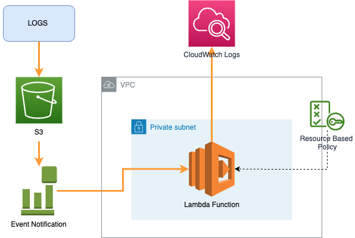

# AWS-logs-forwarding-s3-to-cloudwatch
Stream AWS Load Balancer, Cloudfront and WAF logs that are stored in S3 by default into CloudWatch Logs to use with CloudWatch insights or metrics filter.

The terraform code will create a lambda function with all the necessary resource policy permission and create an event trigger in S3 to trigger the lambda function when new object are created in S3. The lambda function will extract the S3 object and process it line by line - it will create a log stream in the CloudWatch Log Group where logs will be injested to and logs wil be forward in batches by calling the CloudWatch logs `putLogEvents` API. 

# Run the Terraform Code Project
1. Input the necessary information in `dev.tfvars`
2. Run `terraform init`
3. Run `terraform plan var-file=dev.tfvars`
4. Run `terraform apply var-file=dev.tfvars`

